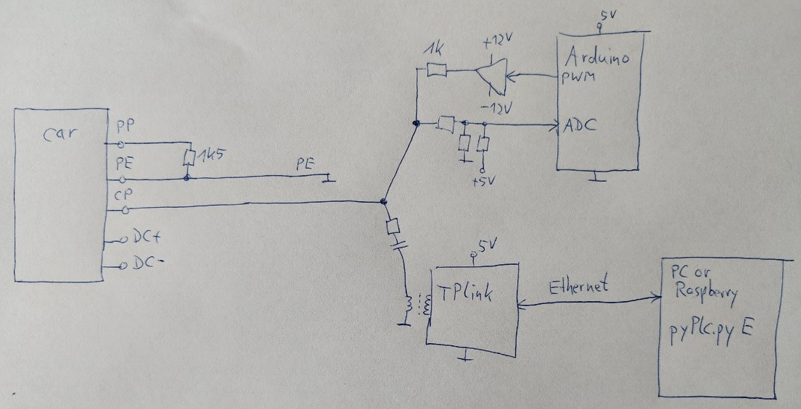
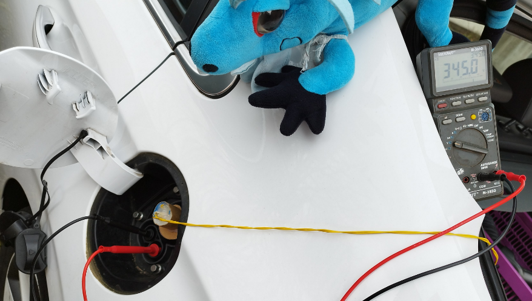
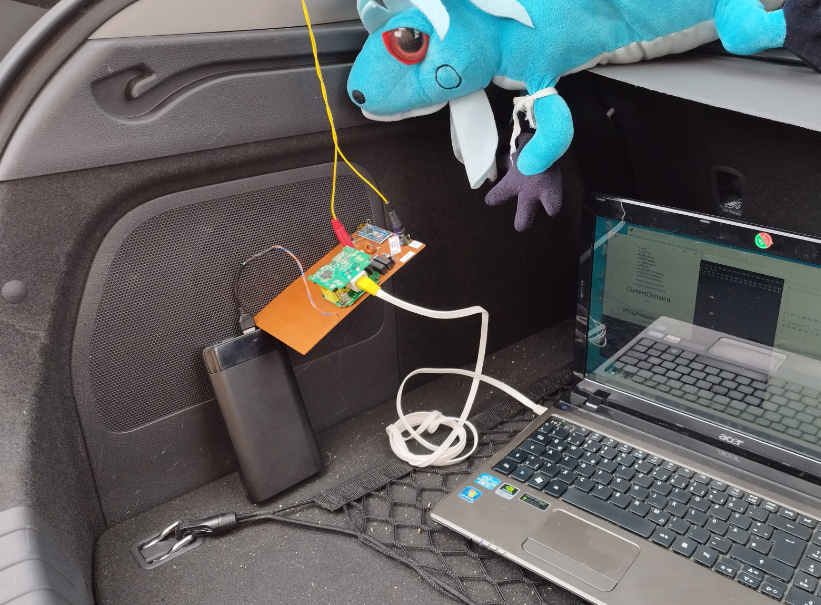
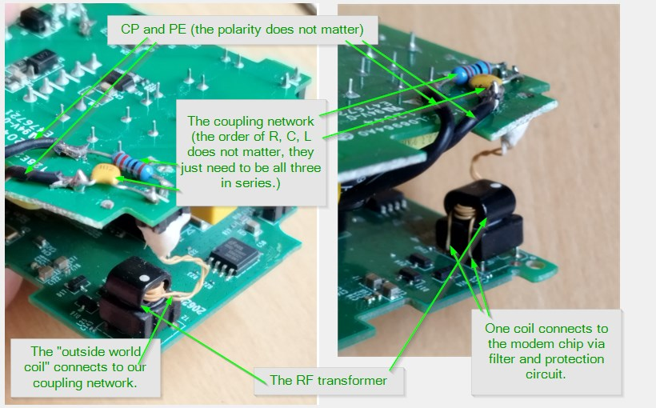
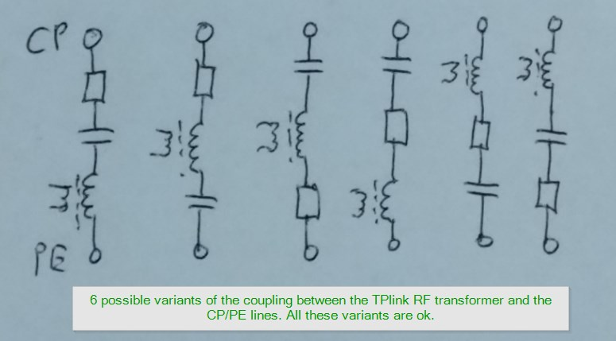

# EvseMode

This document describes how to use the pyPlc project as a charging station. The possible use cases are to really charge a car via CCS (which requires a lot of additional power-electric hardware), or to investigate whether it is possible to draw energy out of the cars CCS port.

Discussion here: https://openinverter.org/forum/viewtopic.php?t=3551

## Hardware

To convince the car, that a CCS charger is connected, several preconditions need to be fulfilled:
* PP resistor: Between the ProximityPilot and PE (Ground) we must connect 1.5kOhms resistor.
* CP signalling: The ControlPilot needs to be pulled to 12V over 1kOhms. If the car pulls the CP down to 9V, we must provide a PWM with 1kHz, 5% width, plus and minus 12V amplitude via 1kOhm resistor. Basically the CP signalling is the same as in a standard AC wallbox, the only difference is the fix 5% PWM ratio. As wallbox controller I used an arduino, similar to https://www.instructables.com/Arduino-EV-J1772-Charging-Station with the software https://github.com/uhi22/WallboxArduino, and the poti on left border to select 5% PWM.
* Homeplug communication: The car wants to establish high-level communication on the CP line, using the HomePlug standard. We connect a modified homeplug modem between the CP and PE, with coupling network e.g. 150 ohms and 1nF in series, to not disturb the 1kHz PWM too much. The modification of the modem is shown in [Hardware manual](hardware.md)
* On the ethernet port of the HomePlug modem we connect a computer which handles the high level communication. This may be a Windows10 laptop or a Raspberry or similar.
* We need a power supply for the HomePlug modem and the Arduino-charging-logic, e.g. an USB power bank.

## Software

### Configuring the HomePlug modem as Charging Station

The homeplug modem needs a special configuration, to support the features which are needed for a charging station. We need to write a special configuration file to it. This is necessary only once, the modem will store the settings non-volatile.
Details in readme.md chapter "Configuration of the PLC adaptor".

### Installing pyPlc and openV2Gx on the computer
See [Raspberry installation manual](installation_on_raspberry.md) or 
[Windows installation manual](installation_on_windows.md)

## First run into charging loop
Notebook is connected via Ethernet cable to the homeplug modem. The homeplug modem and the arduino-charging-logic is supplied by an USB power bank. The PE from the car is connected to ground of the homeplug modem and ground of the arduino-charging-logic. The CP of the vehicle is connected to the hot side of the homeplug modem and the hot side of the arduino-charging-logic. The PP of the car is connected to PE via 1k5 (inside the plug).
On the laptop, just run `python pyPlc.py E`.

## FAQ

### Q1: What is the purpose of the PP pin, and do I need to connect it?

The car uses the ProximityPilot (or PlugPresent) to detect, that a plug has been inserted. For CCS2, we need to connect a 1.5kohms resistor between
the PP and the ProtectiveEarth (PE), otherwise the car most likely does not initiate any communication. The resistor can be directly placed
into the plug.
In CCS1 case, the resistance is different, and a button can be added, too. Discussion and explanation here: https://openinverter.org/forum/viewtopic.php?p=59932#p59932

### Q2: Where can I address questions or distribute my testing results?

Discussion is ongoing in the OpenInverter forum https://openinverter.org/forum/viewtopic.php?t=3551 "Drawing power out of CCS port (V2x, inverse charging, bidirectional CCS)"

### Q3: How can I configure pyPLC in EVSE mode?

There are two ways:
1. In the pyPlc.ini, set `mode = EvseMode`. Then just run pyPlc without any command line parameter: `python pyPlc.py` (on Windows) or `sudo python pyPlc.py` (on Raspberry).
2. No matter which mode has been configured in the ini file, you can overrule the setting on command line, by providing the letter E (like Evse) as first
command line parameter: `python pyPlc.py E`.

### Q4: Is it possible to close the cars contactors using this simple setup?

It depends. The car only will close the contactors, when it is convinced, that the precharge phase is done. This means, the car sees that
the charger has setup the voltage to the same level as the battery voltage of the car. There are three ways, how the car could determine
the voltage on the CCS: (1) By physical voltage measurement on the CCS inlet, or (2) by relying on the voltage which is provided by the
charger (it is called EvsePresentVoltage), or (3) by evaluation both methods (1) and (2) together.

Each vehicle type has a certain behavior, some examples are collected in the OpenInverter forum (link above).

### Q5: Can I use a BeagleBone instead of the Raspberry?

Yes. Each linux computer which has an Ethernet port to connect the TPlink should work.

### Q6: Can I use an other modem, e.g. YellowBeet or RedBeet?

Yes. Just the following things need to be considered: The board must be integrated into the linux computer so that a (virtual) ethernet port is
present. This interface name must be configured in the pyPlc.ini, so that pyPLC uses the correct interface. And the correct configuration of the modem must be used: A modem which is configured as PEV (car) will not work as EVSE.

### Q7: Besides the Python version (pyPLC), is there an embedded solution available?

Not at the moment. The embedded CCS solutions on ESP32 or STM32 are implementing the PEV (car) side only (https://github.com/uhi22/ccs32, https://github.com/uhi22/ccs32berta, https://github.com/uhi22/ccs32clara)

### Q8: Which side of the TPlink is the PE and which is the CP?

The TPlink has a RF transformer with two or three coils. One or two coils are connected to the modem chip (the transmit and the receive path), and the
last coil is the way to the outside world, in our case the CP and PE. The modulation does not care for the polarity of this path. It uses
radio frequencies in the range of 2MHz to 30MHz.
This means, it does not matter which side of the "outside coil" is connected to PE and which to CP.
The only important thing is, that the coil does not connect directly to the CP and PE, because this would destroy the 12V PWM signal, which
lives in parallel on the CP / PE lines. The coupling network of 1nF and 150ohms in series assures, that the RF signals and the 12V PWM
are not interfering each other.

In other words: between the CP and the PE, there is the series of tree components: The 1nF, the 150ohm, and the secondary coil of the RF transformer. The order does not matter, also the polarity not. This means, to remove all parts on the TPlink which are connected to the secondary coil of the RF transformer, and connect the 1n and 150ohms to it.

Regarding the type of capacitor and the exact values of the C and R: The precise values do not matter, I guess everything between 33 ohms and 220 ohm should work, and also 0.5nF, 1nF and 2.2nF. Higher capacitor values could slow the edges of the 1kHz PWM, so this should be avoided. The type of capacitor does not matter.

The picture shows the two-coil variant:

These are the possible coupling variants. All are fine:

