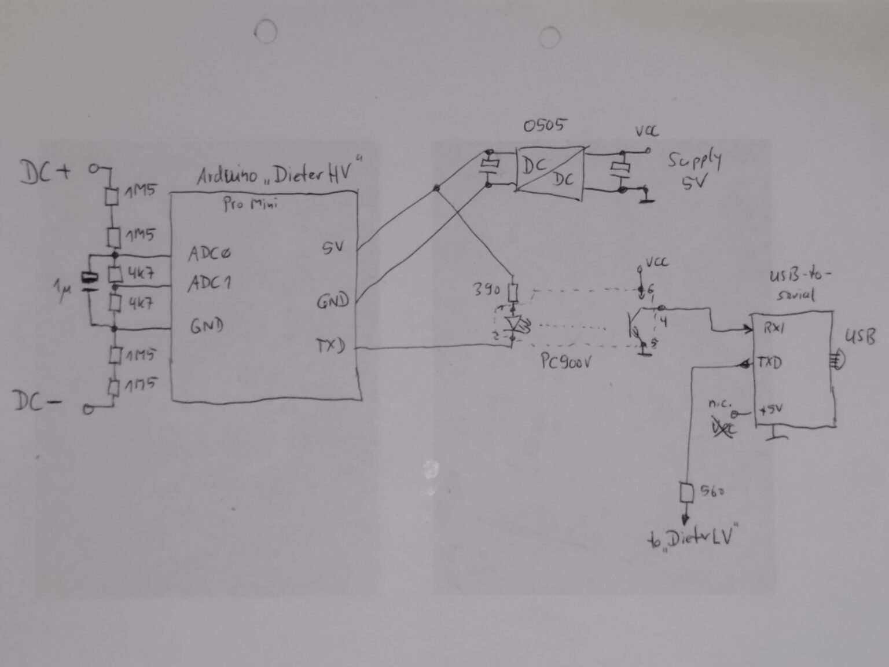
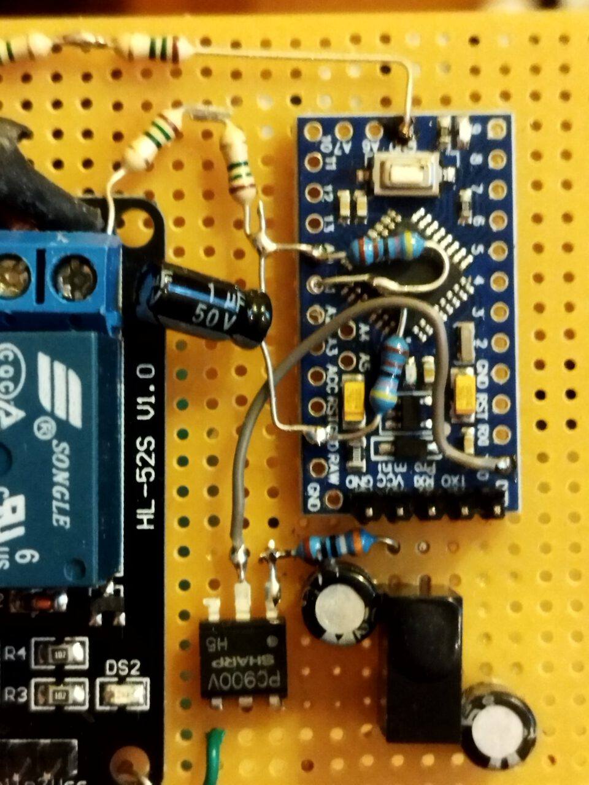
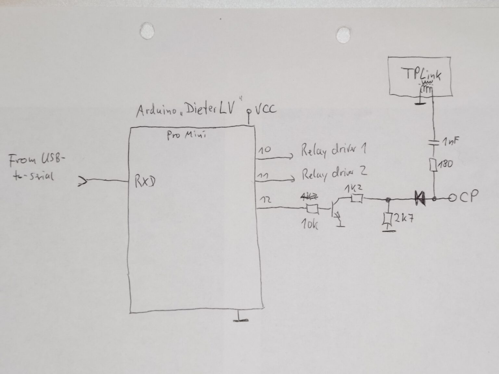
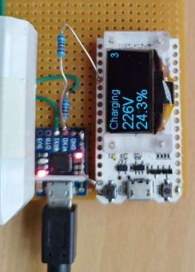
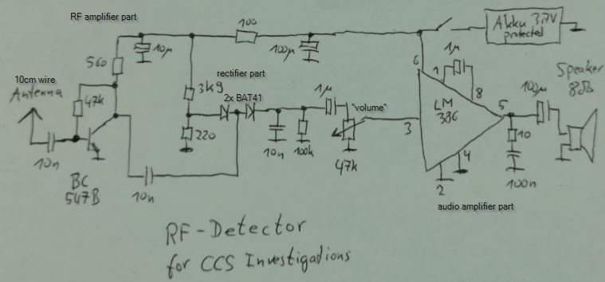

# Hardware for CCS Sniffing

## Homeplug adaptors

### Devolo dLAN 200 AVplus

Contains an Atheros INT6400A1G.

Pro:
* Routes the SLAC traffic from RF port to Ethernet, using the original software (INT6000-MAC-4-4-4405-00-4497-20101201-FINAL-B)
and unchanged parametrization.
* Works as CentralCoordinator. This means, it sends out "coordinator packets" which enables the connected car to send out the first SLAC message.
* Works on the PEV side with original software and original parametrization.

Contra:
* Does not support the read-out of the configuration using the github.com/qca/open-plc-utils.

### Devolo Powerline 200+ MT2710

Is discussed here: https://openinverter.org/forum/viewtopic.php?p=57003#p57003
It uses an Atheros AR6400-AC30.

Todo: To be tested...

### Devolo dLAN 1200+
Todo: add picture how to connect the DC power and the RF

The open-plc-utils report the version MAC-QCA7500-2.8.0.30-01-20190707-CS.

Contra:
- Even with the modified configuration for pev (according to https://openinverter.org/forum/viewtopic.php?p=55120#p55120), the QCA7500 does not send SLAC parameter requests. This means: Cannot be used as pev.

### TPlink TL-PA4010P
This adaptor was suggested by https://openinverter.org/forum/viewtopic.php?p=37085#p37085 and there,
successfully used to establish a communication to the CCS charger.

Pro:
* Can be configured as pev and as EVSE, using two different configuration files (created and patches with github.com/qca/open-plc-utils)
* Is able to transmit and receive the SLAC messages, if the special config files are used.

Contra:
* In original parametrization, does not support SLAC (not routed from RF to Ethernet, and not vice versa).
* Depending on the configuration, only one direction of the SLAC is routed from RF to Ethernet. Means: Not suitable for sniffing the complete
SLAC sequence.

Power supply: Originally, it has 12V internal supply. There is a DC/DC step down converter included, which supplies the chipset with 3.3V.
Works on the original 12V supply line also with 13V/110mA, 10V/120mA, 6V/190mA, and, which reduced RF output power, down to 5V/220mA and even 4V/240mA.
Just supplying 5V from an USB power bank at the original 12V line works fine. The only drawback is a slightly reduced transmit power, because
the RF transmitter is connected to the 12V, but is is no issue, because it has anyway much too much transmit power for the CCS use case.

How to modify:
- remove the housing
- remove the AC power connector parts
- connect cables to supply the device. Works with 12V, also works with 5V from an USB power bank.
- connect cables and circuit (1nF and 150ohms in series) for connecting to the pilot line.

## Controller for the PEV

Besides the homeplug modem, there are additional parts necessary for a vehicle to perform CCS charging. Two of these are: 1. The inlet voltage measurement. 2. The control of CP state and relays.

### DieterHV

This is the high-voltage Dieter. It is responsible to measure the CCS inlet voltage. DieterHV is an Arduino Pro Mini, running the software from https://github.com/uhi22/dieter, and DieterHV has a quite simple task: Measure the divided voltage from the CCS inlet, and write the output of the ADC to the serial line, with 19200 Baud. The hardware includes a 5V-to-5V-DCDC converter (e.g. B0505S-1W) and a PC900V optocoupler. In the current version, the ADC0 is the main channel, and the ADC1 gets half of the voltage and may be used for plausibilization. Potential improvement could be, to enable also negative voltage measurement, to be able to detect wrong polarity.

### DieterLV

This is the low-voltage Dieter. It controls the ControlPilot state, by switching an additional 1.2kOhm resistor in parallel to the permanently connected 2.7kOhm. Additionally, the DieterLV controls two relays via simple drivers. In the demo, these relays connect the DC from the CCS inlet to a light bulb.
Also DieterLV is an Arduino Pro Mini, and it is running the same software as DieterHV. It receives the output control requests via serial line with 19200 Baud, and sets its digital outputs accordingly.

### OLED Display

To show the status, the voltage and the SOC in PEV mode, there is an OLED display connected to the serial line of the USB-to-serial-converter.
The display is programmed to receive data via serial line and show three lines. The python script is using the function self.hardwareInterface.showOnDisplay(s, strAuxInfo1, strAuxInfo2)
to fill these three lines on the display.

The display is an ESP32-powered board named "WIFI_KIT-32", available e.g. from
https://de.aliexpress.com/item/1005002931025729.html?spm=a2g0o.productlist.main.23.3d607f4fVNGcAr&algo_pvid=338e0303-b3b2-45c7-94b6-4a55bba4009e&algo_exp_id=338e0303-b3b2-45c7-94b6-4a55bba4009e-11&pdp_ext_f=%7B%22sku_id%22%3A%2212000022853967835%22%7D&pdp_npi=3%40dis%21EUR%2113.87%2111.37%21%21%21%21%21%402100b78b16774931785037679d0714%2112000022853967835%21sea%21DE%210&curPageLogUid=TGlYiLzgZW4i

The arduino sketch is available at https://github.com/uhi22/SerialToOLED

The connection is simple: The 5V from the USB-to-Serial-converter board are supplying the WIFI_KIT-32, and the TXD of the USB-to-Serial-converter goes via an 1k5 protection resistor to a digital input of the WIFI_KIT_32.

### USB

Both, DieterHV and DieterLV communicate with 5V serial line with 19200 Baud. To connect these to the Laptop or Raspberry, we use a cheap USB-to-Serial converter with CP2102, similar to https://www.ebay.de/itm/122447169355?hash=item1c826b874b:g:PKYAAOSwBoVjdS28&amdata=enc%3AAQAHAAAA4IQcw6se5g1eqWsesz2sVJybly8WfWQrHcT%2BKk2kbf3dRjRl5Iimf8p54m2HcnGpjpFaTQqdKE0wrxuPJYLQcmOtofOYlAbClGhlgeIn21NQPaCGzqCSAMAI6yXqfsfCpsBZtJe1%2BfAfIOq1kEPDJBbWD6UFAv6%2FhR%2B6WxeiQKeaVSwc%2BRs87aBn0XbtWmF2p0C9RTURpWQauDpaWLsAthbiVBqBjeNkPQxMSx1AMUa33bO0OZakXjXyHVrGhEXRO7952z1oHjKyl51E0YX7Jqb5hA7GhAs%2BUGvPnBAbjKnH%7Ctkp%3ABFBMipSf-Kdh
Its receive path is feed by the DieterHV via optocoupler, and its transmit path is connected to the DieterLV via a protection resistor.
On software side, the python module hardwareInterface.py handles the communication with the serial devices.

## CCS Detector

In some cases it may help to "hear" the CCS communication, to understand what is going on. For this, a detector receiver can be used,
e.g. this one:

By placing the antenna near to the charging cable and just listening, it is possible to differentiate the following cases:
* Silence: No communication is going on. No homeplug coordinator is present. No 1kHz PWM is present.
* Continuous uniform rattling noise: Homeplug coordinator (charger) is there. Depending on the chargers implementation, this may be quite loud (e.g. Compleo) or less loud (e.g. Alpitronics).
* 1kHz tone: The charger provides 1kHz PWM.
* Click tones in faster or slower intervals: The communication is ongoing (SLAC, SDP, TCP). Depending on the implementation of the charger and car, this may be very loud (e.g. TPlink modem supplied by 12V) or less loud (some original cars).

## Electric vehicle simulator

This device is able to convince an AC charger to deliver power, and also is needed to tell an DC charger, that a car is connected. By closing the "vehicle detected" switch, we pull the CP from 12V to 9V, and the charger will switch to the 5% PWM and starts listening to SLAC parameter request messages. (If DieterLV is controlling the CP, we do not need the EV simulator anymore.)

## Combination of EV simulator, HomePlug modem and Raspberry

## Connecting to a real-world charger

