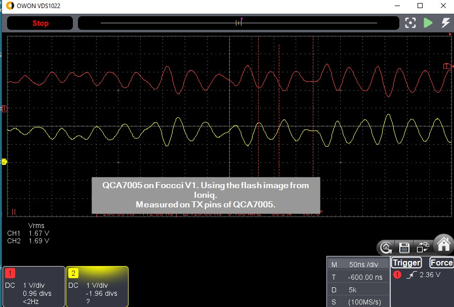
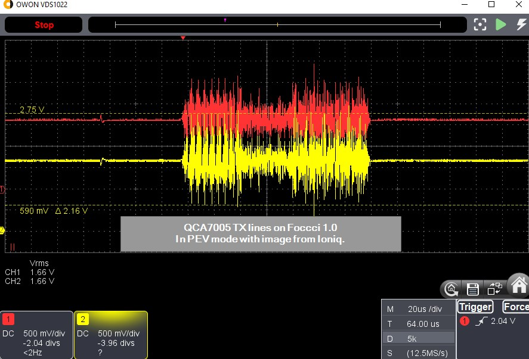
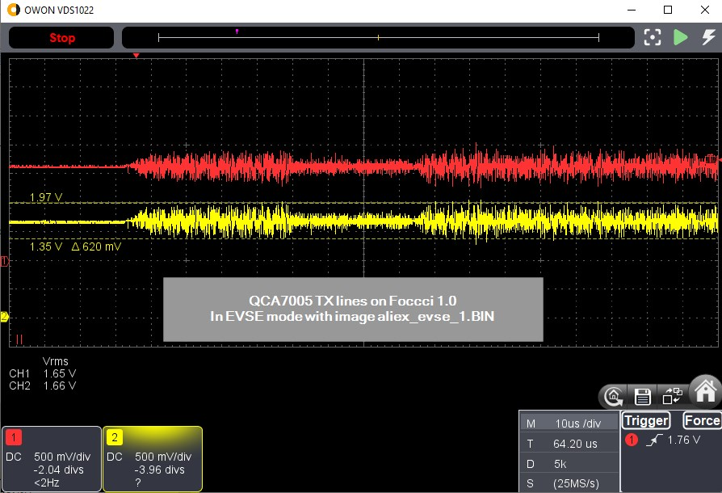
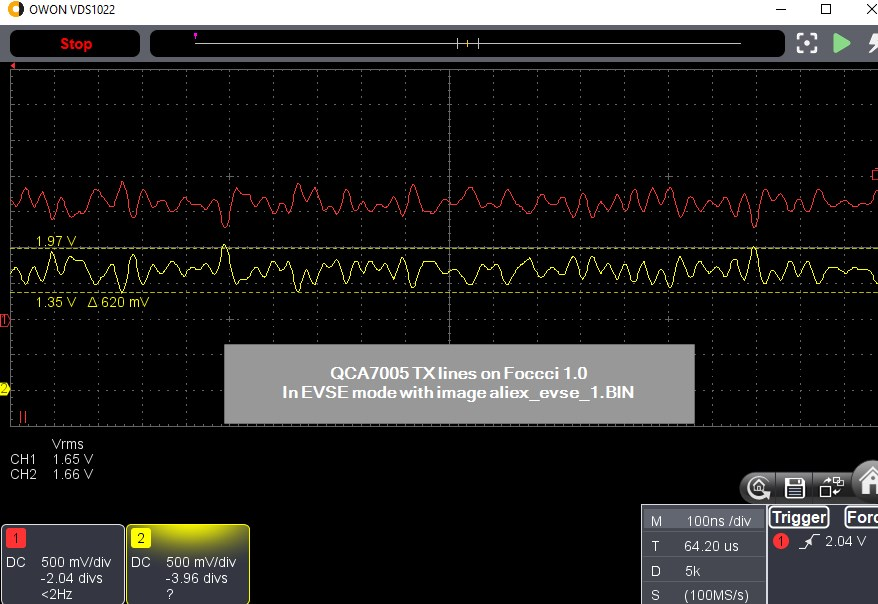

# PLC signal amplitudes

To have comparable results, we measure the peak-to-peak voltage of the preamble of the homeplug packet.

1. Homeplug modem with AR7420, supplied by 5V
10Vpp at the transformer

2. Homeplug modem with AR7420, supplied by 5V, with 150ohm series resistor between transformer and CP.
Foccci v3 (including transformer with RIK10, 2x5 turns) connected via 1m twisted pair.
3Vpp at the CP line

3. Like 2, but in the homeplug modem two additional series resistors 680ohms in the transmit path, between
the power amplifier and the transformer.

- EVSE packet: 250mVpp at the CP line 
- Foccci packet: 500mVpp at the CP line

4. Like 3, but in the homeplug modem the two 680ohm in serial and a 10ohm in parallel to the transformer.

- Foccci packet: 500mVpp at the CP line (no change, normal)
- EVSE packet: hardly measurable, in the 20mVpp range.
- Communication still works perfect.

5. Compleo 20kW triple charger

Sends very loud packets, even if no vehicle is connected.
17Vpp

6. ISO 15118-3

On both, EVSE side and EV side of the charging cable, the typical voltage is
1.3Vpp.
This is specified as "power spectral density" of typical -75dBm/Hz at 1.8MHz to 30MHz, receiver band width 9kHz with 50 ohms.

Example states the following levels:
- Transceiver output: -72dBm/Hz
- CP on EVSE: -76dBm/Hz
- CP on PEV: -78dBm/Hz
- Transceiver modem input: -81dBm/Hz
This would be 9dB between transmitter output and receiver input.

7. Output of the QCA7005

4Vpp. Each output (TX+ and TX-) sit at ~1.6V statically, and move 1V up and 1V down. So the differential voltage
reaches from -2V to +2V, which is 4Vpp.

8. Foccci 5.1 transmit level

with 120ohm termination

270mVpp

9. Foccci 5.1 receive limit test

- Foccci sees the EVSE, starting to become instable, if 400mVpp -36dB. This is 400mVpp / 64 = 6mVpp.
- Foccci sees single messages, if 400mVpp -42dB. This is 3mV.
- Foccci does not see the EVSE (modem goes to sleep) if 400mVpp -44dB. This is 400mVpp/158 = 2.5mVpp.

10. Foccci 5.1 transformerless patch, R25=100ohms, receive limit

- 400mV -32dB stable connection.
- 400mV -38dB still works, starting to become instable.
- 400mV -44dB sometimes modem sleep, sometimes not.
- 400mV -50dB modem sleep.

11. Foccci 5.1 transformerless patch, R25=100ohms, transmit level

210mVpp

## 12. Foccci 1.0 directly measured on TX pins of the QCA

### with flash image of the ioniq

available here: https://github.com/uhi22/Ioniq28Investigations/blob/main/CCM_ChargeControlModule_PLC_CCS/QCA_Analysis/CCM_FlashDump_SpiFlash_2MB_Ioniq_00_33_79.bin

~2.1Vpp

### with flash image of the aliexpress modules, EVSE_1

available here: https://openinverter.org/forum/viewtopic.php?p=33730#p33730

~620mVpp

# Attenuation calculator

https://www.digikey.de/de/resources/conversion-calculators/conversion-calculator-attenuator

* -6dB  is half voltage
* -12dB is quater voltage
* -20dB is tenth voltage
