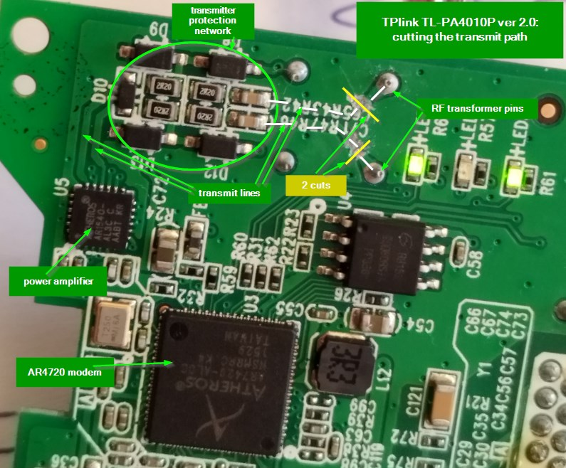

# Experiments for Sniffing

* Configuration of the sniffer device

## Q: Does it help or harm, to set the hfid different to "PEV", e.g. "PEV5E"?

* prepare a PIB with EVSE setting, but the following special setting: `pi@RPi3D:~ $ setpib pev5E.pib 74 hfid "PEV5E"`
* flash the PIB on a AR7420 modem
* try to run this as EV against an EVSE consisting of AR7420 and pyPLC
* result: works.
* conclusion: Having in the PEV an other HFID than "PEV" does not harm.

## Q: Which messages can be sniffed using the PEV configuration of an AR7420?

* Test setup:
    * EVSE using pyPLC and AR7420 on Raspberry.
    * PEV is Foccci (QCA7005)
    * Sniffer with AR7420, configured as PEV, with hfid "PEV5E". Win10, wireshark.
* Procedure:
    * start EVSE
* Observed:
    * wireshark shows the CM_SLAC_PARAM.CNF, CM_ATTEN_CHAR.IND and CM_SLAC_MATCH.CNF.
* Conclusion: Using a modem which is configured as PEV, we see only the SLAC messages of the EVSE.

## Q: Is it possible to join a network by extracting the NID and NMK from the slac_match.cnf?

* Test setup:
    * As above.
    * In pyPLC, set smart_listener_configuration = 1. This means, as soon as the pyPLC receives the slac_match.cnf, it will configure its modem with the key.
    * In the EVSE, set udp_syslog_enable = Yes, to have some broadcast frames in the network, which allows to see whether the listener has joined the network, and to see when.
* Observed:
    * listener sends the set_key
    * modem of the listener restarts (LEDs off / on)
    * wireshark shows the syslog UDP messages of the EVSE.
    * Bad: Modem needs more than 5s for restart (between the setkey and the first visible UDP message)
    * Bad2: Only the broadcast messages are visible, not the unicast messages.
    * Log: 2025-01-21_listenMode_01_slow_and_only_broadcast_visible.pcap
* Conclusion: Yes, joining the private network works.
    
## Q: Does it help or hurt to spoof the MAC address, so that the listener claims to have the same MAC as the PEV?

* Reference: This was discussed here: https://github.com/uhi22/pyPLC/issues/39
* Test setup:
    * As above.
    * In pyPLC, set smart_listener_configuration = 2. This triggers sending cyclic messages with the PEV MAC as source.
    * message cycle time ~30ms
    * using UDP syslog broadcast message for this purpose
* Observed:
    * Some V2GTP data is visible, mostly as TCP retransmissions. Yeah.
    * charging comes until CableCheck (sometimes), then it aborts.
    * Log: 2025-01-21_listenMode_02_mac_spoofing_some_frames_visible.pcapng and 2025-01-21_listenMode_03_mac_spoofing_some_frames_visible.pcapng
* Conclusion: Using the MAC address of the PEV in the listener helps to receive TCP data. Still with the limitations:
    * charging is interrupted. Most likely because too many messages lost due to wrong routing.
    * Not all frames are routed. Most likely because the homeplug network coordinates the MAC back to the PEV.
    * Unlikely that both sides can be observed with this approach, it catches just the direction from EVSE to PEV.

## Q: Does it help or hurt to disable the physical transmit path, to avoid that the listener modem is involved into coordination?

* Test setup:
    * As above, but the transmit lines on the listener modem cutted before the transformer.
    * 
* Observed:
    * Receive path still works. We see the three SLAC messages.
    * setkey.req is sent, and the modem sends the confirmation as usual
    * modem restarts, but does NOT enter the private network. The middle LED stays off. The listener does not receive any UDP/TCP messages.
    * Logs: 2025-01-21_listenMode_04_cutted_tx_path_no_joining.pcapng and 2025-01-21_listenMode_05_cutted_tx_path_no_joining.pcapng
* Conclusion: Cutting the transmit path makes it worse: Listener cannot join the network anymore.

## Q: Does the sniffer modem contain "automatic rules" to filter out the not wanted traffic?

* Background: The homeplug specification (Ref2) explains, that the routing between the RF port and the Ethernet port is done in the "convergence layer", and the routing is controlled by "classifier rules". These rules can be viewed and changed using the qualcom tool (Ref3), with the command "int6krule" (Ref4). At least in theory.

* Test setup:
    * Three nodes: Foccci as PEV, Win10 with pyPLC and AR7420 as EVSE, Raspberry with pyPLC and AR7420 as listener.
    * all modems in the same AVLN.
    * Win10 sends some broadcast messages.
* Experiment1: Try to read the classifier rules (on the raspberry. From the local modem.)
* Result1: request is sent. response comes back, but no rule shown.
* Experiment2: add a classifier rule: dropRX for EthernetSourceAddress==MacOfTheWin10.
* Result2: This works. The messages disappear.
* Experiment3: list the rules. int6krule -i eth0 -r -v local
* Result3: The configured rule is correctly shown.
* Experiment4: remove the rule.
* Result4: The formerly suppressed messages are now back again.
* Experiment5: try to remove the rule again.
* Result5: Error message. This makes sense, because removing twice cannot work.
* Experiment6: Set a rule to all three nodes in the network: add .... broadcast
* Result6: The tool only shows the local response. In Wireshark we see all three responses.
* Experiment7: Read the rules from all three nodes: int6krule -i eth0 -r -v broadcast
* Result7: The tool shows only the local response. In Wireshark it is interesting:
    * The two AR7420 modems show the rule.
    * Focccis QCA7005 does not show the rule.
* Experiment8: Remove the rule from all three nodes. remove .... broadcast
* Result8: In wireshark, all three answer in the same way. No error.
* Experiment9: Try to remove the rules again from all three nodes.
* Result9: In wireshark, all three nodes show the negative response.

Conclusions:
* Adding and removing classifier rules works.
* When asking for the actual rules, the answer does not tell the full truth. The QCA hides the rule, but it is there. Because we get a positive response when we try to remove it, and get a negative response if we again try to remove it. Let's call this feature "hidden rules".
* There is no rule shown, if we do not explicitely configure rules.
* This means: It is not clear, whether the filtering of unwanted traffic uses "hidden rules", or whether this is done on an other layer independent of the classifier rules in the convergence layer.

Ideas:
* Maybe there are "hidden rules" which filter out the unwanted traffic. Maybe it is possible to remove these rules.
    * For example: DropRX EthDA for the other two participants, or DropRX IPV6DA or whatever.
* Analyze, which kind of traffic is filtered out and which is routed. Does it depend on the MAC? Or on the IP address? Source or destination address? Or on anything else?

# References

* Ref1: Discussion on github https://github.com/uhi22/pyPLC/issues/39
* Ref2: Homeplug AV 1.1 specification: google for "homeplug_av11_specification_final_public.pdf"
* Ref3: Qualcom PLC tools https://github.com/qca/open-plc-utils
* Ref4: Description of the int6krule command https://man.cx/int6krule(1)

