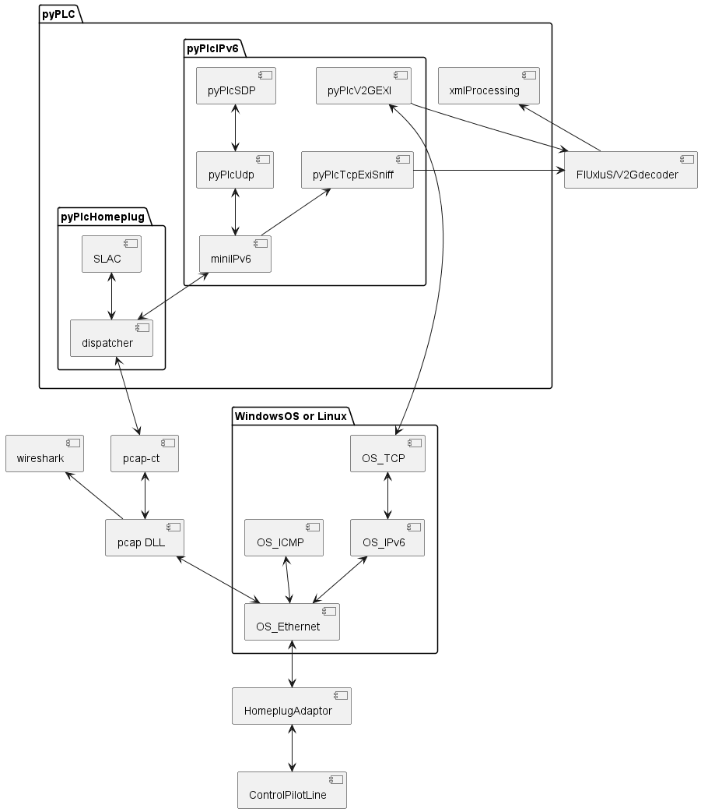

# CCS hacking: Electric car charging experiments with Python and PLC network adaptors

## Goal
This project tries to use cheap powerline network adaptors for communication with electric cars charging system.

There are three different use cases, where this project can be helpful:
1. Sniffing the traffic between an CCS charger and a car. For instance to measure which side is the limiting element for reduced charging power.
In this project, we call this mode *ListenMode*.
2. Building a charger for CCS or for AC with digital communication. We call this *EvseMode*. [EvseMode manual](doc/EvseMode.md)
3. Building a charging unit for a car which does not support powerline communication. Let's call it *PevMode*.

## News / Change History / Functional Status

### 2023-06-29 v0.9 Released

Highlights:
- pyPLC in EvseMode runs together with the SmartEvse and fetches the SOC from the car before AC charging: https://github.com/SmartEVSE/SmartEVSE-3/issues/25. Thanks to arpiecodes, ArendJanKramer, fluppie and co for the contributions.
- pyPLC works as CCS-to-CHAdeMO bridge on johu's Touran: https://openinverter.org/forum/viewtopic.php?p=57908#p57908, https://www.youtube.com/watch?v=tfCaqdUFx3Q Congratulations and thanks for the excellent collaboration.
- celeron55 is on a 5000km road trip with the EVPrevia through Europe and uses pyPLC as the main charging solution. https://openinverter.org/forum/viewtopic.php?p=57940#p57940 and https://www.youtube.com/watch?v=bcMmEXSlFD8 Congratulations and enjoy the trip.

Main improvements between v0.8 and v0.9:
- Improved configuration file incl documentation
- EvseMode: Fix for using the correct SchemaID and checking for DIN protocol in the ProtocolHandshake
- PevMode: CHAdeMO integrated
- EvseMode: Sending SOC etc to the SmartEVSE via http
- Slac: Fix of the RunID

### 2023-05-22 v0.8 Released

Main improvements between v0.7 and v0.8:
- PevMode: waiting for contactors closing
- PevMode: fixes for various timeout times
- PevMode: locking and unlocking of the connector
- PevMode: introduction of SafeShutdownSequence in case of errors. This makes sure, that the contactors are opened only if no current flows, and that the connector is unlocked only if the contactors are opened.
- PevMode: reaction on various error codes and status codes which are reported by the EVSE
- Testsuite: Automatic run of 16 [fault-injection-tests](doc/testing_and_simulation.md) and creation of a test report
- PevMode: Integration of celeron55's hardware interface
- PevMode: Startup scripts from celeron55 which create log file and pcap file per session (linux only)
- Helper: Take a pcap and show voltage, current and SOC in an oscillograph-like diagram (pcapConverter.py, scope.py) https://openinverter.org/forum/viewtopic.php?p=56459#p56459
- Helper: pcapConverter measures the times for CableCheck and PreCharge
- Docu: [Test results from real-world-chargers](doc/charger_test_results.md) (thanks to celeron55 for the many many testing sessions)

### 2023-05-03 First real charging session

Celeron55 is the winner. He managed to combine all the prerequisits, to have the world wide first pyPlc charging session. Congratulations and thanks for the great contribution. https://openinverter.org/forum/viewtopic.php?p=56188&sid=9579fd29268d0e332c81ed528f59f09b#p56188

### 2023-04-19 v0.7 Released
Main improvements between v0.6 and v0.7:
- configuration file
- redesign of the state machines incl introduction of connection manager. This leads to more clear and consistent state transitions.
- simulation mode only controlled by command line parameter instead of instable auto-detection
- more and more consistent data shown in the GUI in both, PevMode and EvseMode
- PevMode: use EVSEPresentVoltage as criteria for end-of-precharge
- EvseMode: Simulated PreCharge, using the target value demanded by car.
- Helper: pcapConverter for converting of pcap files into readable text with the decoded EXI messages
- PevMode: longer timeout for PowerDeliveryResponse
- PevMode: preparation to support BeagleBone GPIO
- PevMode: Logging state names instead of only state numbers
- Timestamp is logged
- EvseMode: use random NMK and set it in the modem
- Improved address resolution (MAC and IP)
- Added numbered checkpoints in docu and log

### 2023-04-16 EvseMode brings the Ioniq to close the contactors
With simulated rising EVSEPresentVoltage in the PreChargeResponse, the Ioniq indeed closes the contactors, without
the need to feed physical voltage to the CCS DC inlet pins. This is surprising, because - at least for ISO -
the specification says that a physical measurement shall be done. The Ioniq does not, it just relys on the
reported voltage on the charger. After closing the contacts, there is the accu voltage on the CCS. Not yet
tested, whether it is possible to draw some current out of the vehicle.
Log here: results/2023-04-16_at_home_Ioniq_in_currentDemandLoop.pcapng
Docu here: [EvseMode manual](doc/EvseMode.md)

### 2023-03-03 v0.6 Tea-Time on Alpitronics charger
Made a tea, using the RaspberryPi3 and tpLink modem on Alpitronics hypercharger.
Pictures here: https://openinverter.org/forum/viewtopic.php?p=53848#p53848

### 2023-02-27 PEV mode with OLED-display works on headless Raspberry
- Charging status is shown on OLED display. Details in [hardware.md](doc/hardware.md)
- RaspberryPi 3 configured to auto-start the PEV software as service. Startup time around 21 seconds from power-up until the SLAC starts. Details 
in [installation_on_raspberry.md](doc/installation_on_raspberry.md)

### 2022-12-21 v0.5 Light-bulb-demo-charging works on multiple chargers
- On 3 of 4 tested charger models, the light-bulb-demo works: AlpitronicHPC, ABB HPC, ABB Triple. The Ionity Tritium overshoots the target voltage due to missing load, and aborts.
- Welding detection gives negative or no answer.
- Traces https://github.com/uhi22/pyPLC/blob/master/results/2022-12-21_westpark_alpi_charge_ok_with_bulb.pcapng and https://github.com/uhi22/pyPLC/blob/master/results/2022-12-21_alpi_ABBHPC_ABB_Ionity_lightbulb_3of4ok.decoded.txt
- Pictures and discussion in https://openinverter.org/forum/viewtopic.php?p=50172#p50172

### 2022-12-20 Measurement of inlet voltage works
- Tests ran on Alpitronics HPC.
- Measuring the inlet voltage with Arduino "Dieter" works. During CableCheck and PreCharge, the inlet voltage is shown in the GUI.
- The Alpi confirms the PowerDelivery (start), but rejects the CurrentDemandRequest with FAILED_SequenceError and EVSE_Shutdown.
- Results (log file and pcap) are stored in https://github.com/uhi22/pyPLC/tree/master/results.

### 2022-12-13 v0.4 On Compleo, Light Bulb survives 400V cable check and PreCharge
- SLAC issue is fixed on Compleo. Authorization works. Hardware interface "Dieter" controls the CP into state C.
- The charger delivers power in the cable check, and a connected 230V bulb makes bright light and survives the 400V.
- PreCharge starts, but terminates before full voltage is reached. Switching the load with power-relay is not yet implemented from
hardware side. Without the load, we see the intended 230V precharge voltage, and run into timeout (to be investigated).

### 2022-12-02 v0.3 On Alpitonics until ChargeParameterDiscovery
- TCP connection works now on Alpitronics charger
- ContractAuthentication loop works

### 2022-11-25 v0.2 On ABB charger until ChargeParamDiscoveryRequest
- With Win10 notebook in PevMode, tested on Alpitronics HPC and ABB Triple charger. On the Alpi, the SLAC and SDP works. The TCP connection fails. On ABB, the SLAC, SDP and TCP works. Also the protocol negotiation works. We come until ChargeParamDiscoveryReqest.
- Log messages are sent via UDP port 514 as broadcast, like Syslog messages. The Wireshark shows them as readable text, so we have the actual communication between car and charger in the trace and also the debug log.
- Example pcap in results/2022-11-25_v0.2_ABB_until_ChargeParamDiscovery.pcapng
- With Win10 notebook in EvseMode, tested on the Ioniq car. It comes until the CurrentDemandRequest.
- For using Raspberry in PevMode without display, there is now the pevNoGui.py, which can be auto-started by configuring a service which calls starter.sh, and this calls starter.py (this is still expermental).
- The old Raspberry model B needs 90s from power-on until it sends the first log messages. Means, the boot is quite slow.
- Raspberry in PevMode and Win10 notebook in EvseMode work well together until the PreCharge.
- Known issues:
	- The TCP port, which is announced in the SDP response, is ignored. This can be the root cause of failing TCP connection on Alpitronics.
	- The SLAC timing includes too long wait times. This may be the root cause for failing SLAC on Supercharger and Compleo.

### 2022-11-15 [*PevMode*] Draft of SLAC sequencer
In PevMode, the software runs through the SLAC sequence with a simulated Evse. After SLAC is finished, we send a software
version request broadcast message, to find out, whether we have at least two homeplug modems in the network (one for the
car and one for the charger). If this is fulfilled, we should use the SDP to discover the chargers IPv6 address. But this
is not yet implemented.

### 2022-11-11 [*EvseMode*] Ioniq in the PreCharge loop
The EVSE state machine, together with the EXI decoder/encoder, is able to talk to the Ioniq car until the PreCharge loop. The
car terminates the loop after some seconds, because the intended voltage is not reached (no physical electricity connected to the
charge port). Maybe it is possible to convince the car to close the relay, just by pretending "voltage is reached" in the
PreCharge response. But maybe the car makes a plausibilization with the physical voltage, then further development would require
a physical power supply.

### 2022-11-09 [*EvseMode*][*PevMode*] Exi decoder first steps working
Using EXI decoder/encoder from basis https://github.com/Martin-P/OpenV2G and created fork https://github.com/uhi22/OpenV2Gx to
provide a command-line interface, which can be used by the python script. The OpenV2G includes generated source code for four
xml schemas (Handshake, DIN, ISO1, ISO2), provided by Siemens. Seems to be good maintained and is very efficient, because the
decoder/encoder are directly available as C code, dedicated for each schema. This skips the slow process of reading the schema,
parsing it, creating the grammer information. On Windows10 notebook, measured 15ms for decoder run from python via command line.
The OpenV2G was compiled on Windows10 using the included makefile, using the `mingw32-make all`.
The OpenV2G decoder/encoder code reveals some differences between the different schemas (DIN versus ISO). As starting point, only the
DIN schema is considered in the command line interface and python part.

The python part now contains the charging state machines for car and charger, as draft.

Using the TPlink and Win10 laptop as evse, connected to Ioniq car, the python script successfully succeeds to SLAC, TCP connection,
schema handshake, SessionSetup, ServiceDiscovery, ServicePaymentSelection. It stops on ChargeParameterDiscovery, most likely to
missing or wrong implementation. Results (log file and pcap) are stored in
https://github.com/uhi22/pyPLC/tree/master/results.

As summary, the concept with the python script together with the compiled EXI decoder works. Further efforts can be spent on
completing the missing details of the V2G messages.

### 2022-10-26 [*ListenMode*] Network/AVLN is established
Using the TPlink in EVSE mode and Win10 laptop, listening to a communication setup between real car and real alpitronics charger, the python script
successfully extracts the NID and NMK from the SLAC_MATCH response, sets this information into the TPlink, and the TPlink turns three
LEDs on. Means: Network established. When we send a broadcast software version request, we get three responses: One from the TPlink, one from the
PLC modem of the car, and one from the PLC modem of the charger. This confirms, that the network is established.
But: From the higher level communication (IPv6, UDP, TCP) we see only the broadcast neighbor solicitation at the beginning. The remaining traffic
is hidden, most likely because the TPlink "too intelligent", it knows who has which MAC address and hides traffic which is not intended for the
third participant in the network. Trace in results/2022-10-26_WP4_networkEstablishedButHiddenCommunication.pcapng

### 2022-10-21 [*EvseMode*] SLAC, SDP and ICMP are working
Using the TPlink and Win10 laptop as evse, the python script runs successfully the SLAC and SDP (SECC discovery protocol). Afterwards, the car uses
neighbor solicitation (ICMP) to confirm the IPv6 address, and the Win10 responds to it. The car tries to open the TCP on port 15118, this is failing
because of missing implementation of the listener on PC side.

### 2022-10-19 [*ListenMode*] Sniffing mode not yet working with the TPlink adaptors
* with a Devolo dLAN 200 AVplus, software INT6000-MAC-4-4-4405-00-4497-20101201-FINAL-B in original parametrization, it is possible
to see the complete SLAC traffic (both directions) which sniffing the communication between a real charger and a real car. This does
NOT work with the TPlink adaptors. They route only "their own" direction of the traffic to the ethernet. Means: The pev-configured device
does not see the real car, and the evse-configured device does not see the real charger. This is bad for sniffing.

### 2022-10-19 [*EvseMode*] Communication/AVLN with Ioniq car established
* Using a TPlink TL-PA4010P with firmware MAC-QCA7420-1.4.0.20-00-20171027-CS and the PIB configuration file patched for evse according to the open-plc-utils docu.
* Python software running on Win10, Python 3.10.8
* On control pilot, sending 5% PWM to initiate digital communication with the car
* Since the TPlink is configured as coordinator, it sends "alive" messages, and the IONIQ starts sending the SLAC_PARAM.REQ.
* Per keystroke, we trigger a SET_KEY before the car is connected. The TPlink responds with "rejected", but this is normal, the LEDs are turning off and on, key is accepted.
* Python script interprets the relevant incoming messages (SLAC_PARAM.REQ, MNBC_SOUND.IND, SLAC_MATCH.REQ) and reacts accordingly.
* After successfull SLAC sequence, all three LEDs on the TPlink are ON, means: Network (AVLN) is established.
* In wireshark, we see that the car is sending UDP multicast messages to destination port 15118. This looks like a good sign, that it wants a ISO15118 compatible communication.


## Discussion and Wiki
See openinverter forum https://openinverter.org/forum/viewtopic.php?p=37085#p37085
and the openinverter wiki: https://openinverter.org/wiki/CCS_EVCC_using_AR7420

## Quick start / overview
- Modify a PLC adaptor hardware, that it runs on battery
- Modify the configuration of the PLC adaptor, that it supports HomePlug Green Phy including the SLAC.
- Install wireshark to view the network traffic
- Optional: Install the Plugin for Wireshark from https://github.com/geynis/v2g-ws-dissectors, to decode the V2GTP. This does NOT decode the EXI itself.
- Install Pcap-ct python library
- Get and compile the exi decoder/encoder from http://github.com/uhi22/OpenV2Gx
- Run `python pyPlc.py` and use keyboard to trigger actions, or
- Run `python pyPlc.py E` for EVSE (charger) mode, or
- Run `python pyPlc.py P` for PEV mode, or
- Run `python pyPlc.py L` for Listen mode

## Architecture


## Hardware preparation
See [Hardware manual](doc/hardware.md)

## Configuration of the PLC adaptor
The factory settings of the Homeplug PLC adaptor do not in all cases support the requirements of the communication
with the car, e.g. the SLAC messages. In detail, the adaptors are supporting HomePlugAV, but we need HomePlugGP (Green Phy). This is similar,
but not the same.
Fortunately, the supplier of the chipset is aware of this topic, and provides some smart helper tools.
http://github.com/qca/open-plc-utils
It is worth to read its documentation, starting in docbook/index.html, this contains all what we need for the next steps. A more detailled description and discussion is available in https://openinverter.org/forum/viewtopic.php?p=55120#p55120.

(Tested on Linux/Raspbian on a raspberryPi 3)

Find the PLC adaptor
```
	pi@RPi3D:~ $ int6klist -ieth0 -v
```
This shows the software version and the mac address.

Read the configuration from the PLC adaptor and write it to a file
```
	pi@RPi3D:~ $ plctool -ieth0 -p original.pib  98:48:27:5A:3C:E6
	eth0 98:48:27:5A:3C:E6 Read Module from Memory
```
Patch the configuration file (see /docbook/ch05s15.html). For each side (pev (vehicle) and evse (charger)) there is a special configuration.
Example pev side:
```
	pi@RPi3D:~ $ cp original.pib pev.pib
	pi@RPi3D:~ $ setpib pev.pib 74 hfid "PEV"
	pi@RPi3D:~ $ setpib pev.pib F4 byte 1
	pi@RPi3D:~ $ setpib pev.pib 1653 byte 1
	pi@RPi3D:~ $ setpib pev.pib 1C98 long 10240 long 102400
```
Write the configuration file to the PLC adaptor
```
	pi@RPi3D:~ $ plctool -ieth0 -P pev.pib  98:48:27:5A:3C:E6
	eth0 98:48:27:5A:3C:E6 Start Module Write Session
	eth0 98:48:27:5A:3C:E6 Flash pev.pib
	...
	eth0 98:48:27:5A:3C:E6 Close Session
	eth0 98:48:27:5A:3C:E6 Reset Device
	eth0 98:48:27:5A:3C:E6 Resetting ...
```
The open-plc-utils contain the programs evse and pev, which can be used for try-out of the functionality, using two PLC adaptors. 

## Installation / Preconditions on PC side

### Usage on Windows10
See [Windows installation manual](doc/installation_on_windows.md)

### Usage on Raspberry
See [Raspberry installation manual](doc/installation_on_raspberry.md)

### Usage on Microcontrollers
This python project is NOT intended for use on microcontrollers like ESP32 or STM32. But there is a variant ported to C for
use in the Arduino IDE, with the ESP32-based WT32-ETH01 board. See here: https://github.com/uhi22/ccs32

## Example flow
This chapter describes the start of a charging session, considering all layers. The checkpoint numbers can be used as reference in code and in the log files.
(Todo: Only a few checkpoint numbers are referenced in the code. Adding more is work-in-progress.)

Precondition: On charger side, there is a homeplugGP-capable device present, which is configured as CentralCoordinator.
* Checkpoint1: The charger (Supply entity communication controller, SECC) creates a "random" value for NID (network ID) and
NMK (network membership key), and configures its homeplug modem with these values.
* Checkpoint2: The charger provides 12V on the control pilot (CP) line (State A).
* Checkpoint3: The user connects the plug into the car.
* Checkpoint4: The car pulls the 12V at CP line to 9V (State B).
* Checkpoint5: The charger sees the level change on CP and applies 5% PWM on CP.
* Checkpoint6: The car sees the 5%, and interprets it as request for digital communication. It wakes up its communication controller (electric vehicle
communication controller, EVCC) and homeplug modem.
* Checkpoint7: The modem of the car sees homeplug coordinator packets on the CP. This is the precondition that it sends anything on HomePlug.
* Checkpoint100: The car starts the SLAC sequence by sending SLAC_PARAM.REQ. Can be also two times.
* Checkpoint101: The charger receives the SLAC_PARAM.REQ and confirms it with SLAC_PARAM.CNF.
* Checkpoint102: The car receives the SLAC_PARAM.CNF.
* Checkpoint103: The car sends START_ATTEN_CHAR.IND, to start the attenuation measurement. In total 3 times.
* Checkpoint104: The car sends MNBC_SOUND.IND, to provide different sounds (signals different frequency ranges). In total 10 times.
* Checkpoint110: The homeplug modem in the charger should measure the signal strength, and report the values to the SECC in an ethernet frame ATTEN_PROFILE.IND. However, the used homeplug adaptor with AR7420 seems not to support this feature. That's why we need to "guess" some attenuation values
for the next step.
* Checkpoint120: The charger sends ATTEN_CHAR.IND, which contains the number of sounds and for each group the attenuation in dB. Pitfall: The car may ignore
implausible values (e.g. all zero dB), and the process may be stuck.
* Checkpoint130: The car receives the ATTEN_CHAR.IND. If it would receive multiple of them from different chargers (due to cross-coupling), the car
decides based on the attenuation levels, which of the charges is the nearest.
* Checkpoint140: The car sends ATTEN_CHAR.RSP to the charger which reported the loudest signals.
* Checkpoint150: The car sends SLAC_MATCH.REQ to the charger. This means, it wants to pair with it.
* Checkpoint155: The charger responds with SLAC_MATCH.CNF. This contains the self-decided NID (network ID) and NMK (network membership key).
* Checkpoint160: The car receives the SLAC_MATCH.CNF, takes the NID and NMK from this message.
* Checkpoint170: The car configures its homeplug modem with the received NID and NMK.
* Checkpoint180: The homeplug modem of the car makes a restart to apply the new settings. This takes approx five seconds. The LEDs of the modem are going off and on again during this restart.
* Checkpoint190: Now, the homeplug modems of the car and of the charger have formed a "private" Homeplug network (AV logical network, AVLN). The RF
traffic can only be decoded by participants who are using the same NID and NMK.
* Checkpoint200: The car wants to know the chargers IP address. In computer networks, a DHCP would be a usual way to do this. In the CCS world, a different
approach is used: SDP, which is the SECC discovery protocol. The DHCP may be also supported as fallback. The car sends a broadcast message "Is here a charger in this network?". Technically, it is an IPv6.UDP.V2GTP.SDP message
with 2 bytes payload, which defines the security level expected by the car. In usual case, the car says "I want unprotected TCP.".
* Checkpoint201: The charger receives the SDP request.
* Checkpoint202: The charger sends a SDP response "My IP address is xy, I will listen on port abc, and I support unprotected TCP."
* Checkpoint203: The car receives the SDP response, and takes the IPv6 address and the port from it, to be used later for the TCP connection.
* Checkpoint204: The car wants to make sure, that the IP addresses are unique and the relation between IP address and MAC address is clear. For
this, it sends a "Neighbour solicitation". (This looks a little bit oversized, because only two participants are in the local network, and
their addresses have already been exchanged in the above steps. But ICMP is standard technology.)
* Checkpoint205: The charger responds to the neighbor solicitation request with a neighbor advertisement. This contains the MAC address of the charger.
In the case, we use this pyPLC project as charger (*EvseMode*), we rely on the operating system that it covers the ICMP. On Win10,
this works perfectly, the only thing we must make sure, that the MAC and IPv6 of the ethernet port are correctly configured in the
python script. Use `ipconfig -all` on Windows, to find out the addresses. Note: Each of the two participants (car and charger) may initiate
the NeighborSolicitation, and the other side needs to respond with a NeighborAdvertisement.
* Note: It depends on the implementation of the charger and car, at which states the NeighborDiscovery is done. It may be in the middle of the SDP,
may be when starting the TCP, and may be never.
* Checkpoint210: Now, the car and the charger have a clear view about addressing (MAC adresses, IPv6 addresses).
* Checkpoint300: The charger starts listening on the TCP port which it announced in the SDP response.
* Checkpoint301: The car requests to open a TCP connection to charger at the port which was announced on the SDP response. This may be 15118 or may be a different port, depending on the chargers implementation. Technically, this is a TCP message with SYN.
* Checkpoint302: The charger, which was listening on that port, confirms the TCP channel, by sending ACK+SYN.
* Checkpoint303: The car finishes the TCP connection setup by sending ACK. This is the end of the "three-way-handshake". TCP state machines on both sides are in state "ESTABLISHED". The car and the charger have a reliable, bidirectional TCP channel.
* Explanation: From now on, the car and the charger use the TCP channel, to exchange V2GTP messages, with EXI content. The charger is the "server" for the EXI, it is just waiting for requests from the car. The car is the "client", it actively
initiates the EXI data exchange. The car walks through different states to negotiate, start and supervise the charging process. From communication point of view, the complete process uses XML data, which is packed in EXI frames, which in turn are transported in the TCP channel mentioned above. The overview over
the various steps is visible in a sequence chart in [viii].
* Checkpoint400: The first request-response-pair decides about which XML schema is used for the later communication. This first communication uses
a special XML schema, the "application handshake" schema. Afterwards, one of the following three schemas will be used: DIN, ISO1, ISO2. These
are different flavours of the DIN/ISO15118 specification, which have small but significant differences. This means, the negotiation of
the exact schema is essential for the next step. The car announces the supported application protocols, e.g. DIN or ISO, using the SupportedApplicationProtocolRequest.
* Checkpoint401: The charger receives SupportedApplicationProtocolRequest and chooses the best application protocol from the list.
* Checkpoint402: The charger announces the decision with SupportedApplicationProtocolResponse.
* Checkpoint403: The car receives SupportedApplicationProtocolResponse and knows now, whether the charger supports a compatible XML schema.
* Checkpoint500: The car initiates the charging session with SessionSetupRequest. The SessionID in
this first message is zero, which is the reserved number meaning "new session".
* Checkpoint505: The charger confirms the session with SessionSetupResponse. In this message, the charger sends for the first time
a new, non-zero SessionID. This SessionID is used in all the upcoming messages from both sides.
* Checkpoint506: The car receives the SessionSetupResponse.
* Checkpoint510: The car sends ServiceDiscoveryRequest. Usually, this means it says "I want to charge" by setting serviceCathegory=EVCharging.
* Checkpoint515: The charger confirms with ServiceDiscoveryResponse. This contains the offered services and payment options. Usually it says which type
of charging the charger supports (e.g. AC 1phase, AC 3phase, or DC according CCS https://en.wikipedia.org/wiki/IEC_62196#FF), and that
the payment should be handled externally by the user, or by the car.
* Checkpoint520: The car sends ServicePaymentSelectionRequest. Usually (in non-plug-and-charge case), the car says "I cannot pay, something else should
handle the payment", by setting paymentOption=ExternalPayment. Optionally it could announce other services than charging, e.g. internet access.
* Checkpoint525: The charger confirms with ServicePaymentSelectionResponse.
* Checkpoint530: The car sends ContractAuthenticationRequest. In non-plug-and-charge case this is most likely not containing relevant data.
* Checkpoint535: The charger confirms with ContractAuthenticationResponse. In case, the user needs to authenticate before charging, this
response does NOT yet say EVSEProcessing=Finished. The car repeats the request.
* Checkpoint536: The user authorizes, e.g. with RFID card or app or however.
* Checkpoint538: The charger sends ContractAuthenticationResponse with EVSEProcessing=Finished.
* Checkpoint540: The car sends ChargeParameterRequest. This contains the wanted RequestedEnergyTransferMode, e.g. to select
DC or AC and which power pins are used. The car announces the maximum current limit and the maximum voltage limit.
* Checkpoint545: The charger confirms with ChargeParameterResponse. The contains the limits from charger side, e.g. min and max voltage,
min and max current. Now, the initialization phase of the charging session is finished.
* Checkpoint550: The car changes to CP State to C or D, by applying an additional resistor between CP and ground.
* Checkpoint555: The car controls the connector lock motor into direction 'lock'.
* Checkpoint556: The car checks whether the connector lock is confirmed.
* Checkpoint560: The car sends CableCheckRequest. This contains the information, whether the connector is locked.
* Checkpoint561: The charger applies voltage to the cable and measures the isolation resistance.
* Checkpoint565: The charger confirms with CableCheckResponse.
* Checkpoint566: The CableCheckRequest/CableCheckResponse are repeated until the charger says "Finished".
* Checkpoint570: The car sends PreChargeRequest. With this, the car announces the target voltage of the charger before closing the circut. The goal
is, to adjust the chargers output voltage to match the cars battery voltage. Also a current limit (max 2A) is sent.
* Checkpoint575: The charger confirms with PreChargeResponse. This response contains the actual voltage on the charger.
* Checkpoint580: The charger adjusts its output voltage according to the requested voltage.
* Checkpoint581: The car measures the voltage on the inlet and on the battery. Alternatively, the car does not measure the inlet voltage, and instead listens to the EVSEPresentVoltage which is reported by the charger.
* Checkpoint582: The above steps (PreChargeRequest, PreChargeResponse, measuring voltage) are repeating, while the
present voltage did not yet reach the target voltage.
* Checkpoint590: If the difference is small enough (less than 20V according to [ref x] chapter 4.4.1.10), the car
closes the power relay.
* Checkpoint600: The car sends PowerDelivery(Start)Request.
* Checkpoint605: The charger confirms with PowerDeliveryResponse.
* Checkpoint700: The car sends CurrentDemandRequest (repeated while the charging is ongoing). In this message, the car tells the charger the target voltage and
target current.
* Checkpoint705: The charger confirms with CurrentDemandResponse. This contains the measured voltage, measured current, and flags which show which limitation
is active (current limitation, voltage limitation, power limitation).
* Checkpoint710: The CurrentDemandRequest/CurrentDemandResponse are repeated during the charging.
* Checkpoint800: When the end of charging is decided (battery full or user wish), the car sends PowerDelivery(Stop)Request.
* Checkpoint805: The charger confirms with PowerDeliveryResponse.
* Checkpoint806: The car receives the PowerDeliveryResponse.
* Checkpoint810: The car changes the CP line from StateC to StateB. (according to Figure 107)
* Checkpoint850: The car sends WeldingDetectionRequest.
* Checkpoint855: The charger confirms with WeldingDetectionResponse.
* Checkpoint900: The car sends SessionStopRequest.
* Checkpoint905: The charger confirms with SessionStopResponse.

## Test results on real-world chargers

See [charger_test_results.md](doc/charger_test_results.md)

## Testing And Simulation On Desk

See [testing_and_simulation.md](doc/testing_and_simulation.md)

## Biggest Challenges
- [*ListenMode*] Find a way to enable the sniffer mode or monitor mode in the AR7420. Seems to be not included in the public qca/open-plc-utils.
Without this mode, we see only the broadcast messages, not the TCP / UDP traffic between the EVSE and the PEV.
The \open-plc-utils\pib\piboffset.xml mentions a setting "SnifferEnable" at 0102 and "SnifferReturnMACAddress" starting at 0103. But setting
the enable to 1 and adding a senseful MAC address does not lead to a difference.
The docu of qca/open-plc-utils mentions ampsnif and plcsnif, but these are not included. An old
release (https://github.com/qca/open-plc-utils/archive/refs/tags/OSR-6010.zip) is mentioning VS_SNIFFER message, ampsnif, plcsnif and even
functions Monitor() and Sniffer(), but these are included from a path ../nda/ which is not part of the public repository.

Any idea how to enable full-transparency of the AR7420?

## Other open topics

See [todo.md](doc/todo.md) and [bug_analysis.md](doc/bug_analysis.md)

## FAQ

### Q1: What is the minimal setup, to catch the MAC addresses in the communication between a real charger and a real car?
- Hardware: A TPlink TL-PA4010P homeplug adaptor, with the configuration for PEV. Modified according to the hardware manual https://github.com/uhi22/pyPLC/blob/master/doc/hardware.md
- Software: Wireshark. Only wireshark. (The pyPlc project and the exi decoder is NOT necessary to sniff the MAC addresses.)

### Q2: Is it possible to use this software, to make the car closing the relay, so that I'm able to draw energy out of the car?
Good question. This depends on how strict the car is. This first hurdle is to convince the car, to close the relay. This is
done after a successful PreCharge phase. And it depends on the implementation of the car, whether it needs physically correct
voltage on the inlet before closing the relay, or whether it relies on the pretended voltage in the PreChargeResponse message.
With setup from [EvseMode manual](docu/EvseMode.md),
the Hyundai Ioniq 2016 closes the contactors by just a simulated charging session. Discussion in https://openinverter.org/forum/viewtopic.php?t=3551, pictures here: https://openinverter.org/forum/viewtopic.php?p=55656#p55656
The second hurdle is, that the car may make a plausibilization between the expected current flow (charging) and the actually
measured current flow (discharging). The car may stop the complete process, if the deviation is too high or/and too long.

However, the software will help to explore and understand the behavior of the car.

### Q3: Is it possible to use this software in a car without CCS, to make it ready for CCS charging?
That's is definitely a goal, and it was reached in the meanwhile. Of course, two aspects need to be considered:
- This project is not a final product. Further development will be necessary to ensure compatibility with chargers, and make it flexible for practical use.
- Some parts are not covered by this project at all, e.g. communication with the BMS, connector lock, safety considerations.

### Q4: Do I need to go to a public charger to test my Pev integration?
For testing the communication at home, the pyPlc supports both sides of the CCS, the car and the charger. Have a
look to [testing_and_simulation.md](doc/testing_and_simulation.md)

### Q5: What can be the reason, that the charger reports a failed cable check?
In the cable check phase, the charger checks the following things:
1. CP/PE lines. The charger expects "State C", this means, the car must connect a diode and two resistors between the CP and the PE. This shall result in PWM levels of -12V and +6V. The charger measures these level, and will complain with CableCheck=Failed if it detects a mismatch. Some potential root causes for failed checks are:
- CP is not connected at all.
- Diode is missing or has wrong polarity.
- Diode is too slow to handle the 1kHz/5%PWM.
- Wrong resistor values chosen or too high tolerance of the resistors
- Connection between circuit ground and PE missing
- too high saturation voltage of the switch transistor
- wrong coupling network between the CP/PE and the PLC modem transformator. This may disturb the PWM levels, due to low-pass-filtering or it may inject too much power from the PLC modem.
- Software not configured to use the correct output path for the StateC switching
2. Isolation of the DC path. It is recommended to use two contactors, one for each DC lines, to avoid asymmetrical results in the isolation measurements.

### Q6: How to connect the PLC modem to the CP and PE?

This is explained in the EvseMode manual. The coupling is the same in EvseMode and PevMode.
[EvseMode.md FAQ Question 8](doc/EvseMode.md#q8-which-side-of-the-tplink-is-the-pe-and-which-is-the-cp)

## Credits
Thanks to catphish to start the investigations regarding the homeplug modems and publishing them on OpenInverter forum.
Thanks to johu for the OpenInverter forum, and for the first video of the early experiments, the beaglebone integration and CHAdeMO integration.
Thanks to CCSknowitall for clarifying tricky details.
Thanks to celeron55 for the large number of test drives to various public chargers, and for improving the software. Thanks for helpful discussions to Pete9008, peternooy, tom91, asavage and all which I forgot to mention.
Thanks to arpiecodes, ArendJanKramer, fluppie and co from the SmartEvse project for the contributions.
Thanks to all patreons.

## Alternatives / Other projects

There are other projects around CCS charging. It's worth a look to the state and progress there.

### SwitchEV

- It is not clear, how they cope with the EXI decoder. In https://github.com/SwitchEV/iso15118/issues/157 it is confirmed
that the Java EXI codec is slow, and they announce a fast, Rust based codec in the Josev_pro variant. And they plan to
integrate https://github.com/chargebyte/openv2g (which is basically the same version 0.9.5 of the Siemens tool as https://github.com/Martin-P/OpenV2G ) for the community version. At the moment this sounds like "either pay or wait".

### EVEREST

- https://github.com/EVerest
- References https://github.com/EVerest/ext-switchev-iso15118. Not clear whether it uses the same Java EXI codec.

### SmartEVSE

- https://github.com/SmartEVSE/SmartEVSE-3/issues/25 discussion is ongoing, how to integrate the ISO high-level-communication

## References
* [i] https://www.goingelectric.de/wiki/CCS-Technische-Details/ knowledge collection
* [ii] https://openinverter.org/forum/viewtopic.php?p=37085#p37085 discussion of this project
* [iii] https://github.com/qca/open-plc-utils utilities for configuring the PLC adaptor
* [iv] https://github.com/karpierz/pcap-ct library for low-level-network-access
* [v] https://github.com/FlUxIuS/V2Gdecoder demo for EXI decoder
* [vi] https://github.com/SwitchEV/iso15118 another "nearly" open source CCS project
* [vii] https://books.google.de/books?id=WYlmEAAAQBAJ&pg=PA99&lpg=PA99&dq=%22ampsnif%22&source=bl&ots=hqCjdFooZ-&sig=ACfU3U0EleLZQu0zWhHQZGktp8OytCMrLg&hl=de&sa=X&ved=2ahUKEwjT0Yq88P36AhWj_rsIHeGMA5MQ6AF6BAgKEAM#v=onepage&q=%22ampsnif%22&f=false How to enable sniffer mode.
* [viii] https://www.mdpi.com/2076-3417/6/6/165/htm "Building an Interoperability Test System for Electric Vehicle Chargers Based on ISO/IEC 15118 and IEC 61850 Standards", including V2G message sequence chart
* [ix] https://www.oppcharge.org/dok/ISO_15118-2_OpportunityCharging_Rev1.3.0.pdf Pantograph specific differences with some insight into ISO15118.
* [x] https://assured-project.eu/storage/files/assured-10-interoperability-reference.pdf Fast and Smart Charging Solutions for
Full Size Urban Heavy Duty Applications
